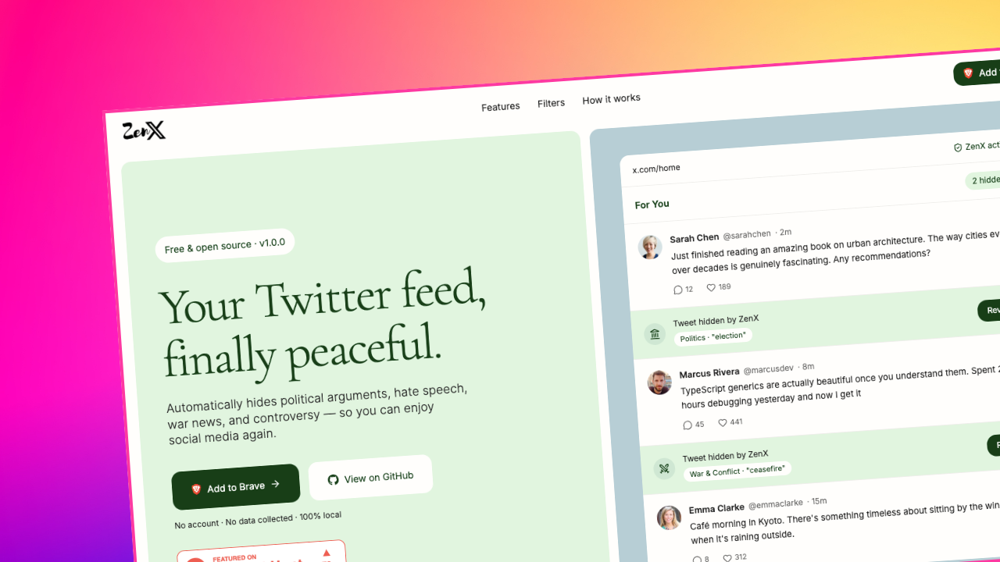

<div  align="center">



<br/>

<br/>

# ZenX — Your Twitter Feed, Filtered Your Way

**ZenX** is a free, open-source browser extension that silently removes toxic, political, and controversial tweets from your X (Twitter) feed — so you can scroll with peace of mind.

<br/>

[](LICENSE)

<a href="https://www.producthunt.com/products/zenx?embed=true&utm_source=badge-featured&utm_medium=badge&utm_campaign=badge-zenx" target="_blank" rel="noopener noreferrer"></a>

[🌐 Website](https://zenx.asimsk.site) · [📦 GitHub](https://github.com/asimar007/ZenX) · [🐛 Report Bug](https://github.com/asimar007/ZenX/issues) · [✨ Request Feature](https://github.com/asimar007/ZenX/issues)

</div>

---

## Why ZenX?

Twitter can be overwhelming — politics, hate speech, war news, and controversy flood your feed every day. ZenX quietly filters that noise out, giving you back a cleaner, calmer timeline without muting hundreds of accounts or keywords manually.

> **ZenX works in the background. You don't notice it — until you realize your feed finally feels peaceful.**

---

## Features

### Content Filters

- 🗳️ **Political Filter** — Removes tweets about elections, politicians & political movements

- 🚫 **Hate Speech Filter** — Blocks racist, bigoted, and discriminatory content

- 🕌 **Religious Debate Filter** — Filters out religious arguments, extremism & controversy

- 💣 **War & Conflict Filter** — Hides tweets about ongoing wars, military strikes & conflicts

- 🔥 **Controversial Topics Filter** — Removes abortion, gun control, cancel culture & more

- ✏️ **Custom Keywords** — Add your own words/phrases to block exactly what you want

### User Experience

- 📊 **Live Stats** — See how many tweets were filtered out of all the tweets scanned, in real time

- 🔄 **Real-time Sync** — Settings sync across all your devices via Chrome Sync

- 👁️ **Peek Mode** — Reveal any filtered tweet with a single click

- 🌙 **Dark Mode** — Adapts seamlessly to X's light, dark, and dim themes

- 🧩 **Onboarding Wizard** — Clean first-run setup — pick your filters and go in seconds

- 🔒 **100% Local** — All filtering happens in your browser. No servers, no data collection.

---

## How It Works

ZenX runs a lightweight content script on `x.com` that:

1.  **Watches** your feed in real time using a `MutationObserver`

2.  **Extracts** tweet text, quoted tweets, and embedded card content

3.  **Scores** each tweet against your active keyword categories using regex matching

4.  **Hides** matched tweets behind a slim row that names the category and matched keyword, with a **Reveal** button

5.  **Logs** stats to local storage and updates the live counter badge

All filtering happens **100% locally in your browser**. No data is ever sent to any server.

---

## Installation

> ZenX is not yet on the Chrome Web Store.

**Easiest way — no terminal needed:**

1. Download the `.zip` file from the [latest GitHub release](https://github.com/asimar007/ZenX/releases/latest)
2. Unzip it anywhere on your computer
3. Open `chrome://extensions` → enable **Developer Mode** → click **"Load unpacked"** → select the unzipped folder

**Full guide (Chrome, Firefox, build from source, updating, troubleshooting): [INSTALLATION.md](INSTALLATION.md)**

---

## Usage

### Popup Controls

#### Toggle Extension

Click the switch in the header to enable or disable filtering without changing your settings.

#### Filter Categories

Switch each category on or off. Open **View keywords** on any category to see or remove individual keywords.

#### Custom Keywords

The **Custom Keywords** card sits with the other filters. Type a word or phrase and press Enter (or **Add**) to block it.

#### Stats Bar

See how many tweets were filtered and how many were scanned. Click the reset button to start fresh.

#### Saving

Category and keyword changes apply when you click **Save changes** at the bottom of the popup. Open X tabs update automatically — no refresh needed.

---

## Development

```bash
# Start dev server with hot reload

bun  run  dev

# Firefox dev mode

bun  run  dev:firefox

# Type check only (no emit)

bun  run  compile

# Create distributable zip

bun  run  zip
bun  run  zip:firefox
```

Hot reload is handled by WXT — changes to popup or content scripts apply instantly without re-loading the extension.

---
